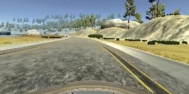

# **Self-Driving Car Engineer - Nanodegree** 
## ---Deep Learning---
# Behavioral Cloning Project

---
[//]: # (Image References)

[image1]: ./writeup/left.jpg "left image"
[image2]: ./writeup/center.jpg "center image"
[image3]: ./writeup/right.jpg "right image"
[image4]: ./writeup/woflip.jpg "without flip image"
[image5]: ./writeup/wflip.jpg "with flip image"
[image6]: ./writeup/cropped.jpg "cropped image"
[image7]: ./writeup/nvidia.jpg "NVDIA Architecture"
[image8]: ./writeup/loss.jpg "Output of loss metrics"


## Introduction
In this project a car should learn how to drive autonomously on a track in a simulator cloning human driving behaviour using TensorFlow and Keras. A convolution neural network should be build and trained to predict the steering angle of the car. The data for training will also be created with the simulator build by Udacity.

 

The goals / steps of this project are the following:
* Use the simulator to collect data of good driving behavior
* Build a convolution neural network in Keras that predicts steering angles from images
* Train and validate the model with a training and validation set
* Test that the model successfully drives around track one without leaving the road
* Summarize the results in a written report


---
## Files and Code

My project includes the following files:
* model.py: containing the script to create and train the model
* drive.py: for driving the car in autonomous mode
* model.h5: containing a trained convolution neural network 
* run1.mp4: a video showing the autonomous driving in the end - recorded final result 
* writeup.md: summarizing the results

#### Run the Model
The model.py file contains the code for training and saving the convolution neural network as model.h5.

By using the Udacity provided simulator and my drive.py file, the car can be driven autonomously around the track through 
```sh
python drive.py model.h5
```

## Implementation

### Creating the Data
The data to train and validate the model will be created with the simulator of Udacty. The data contains images which are taken with a frequency of 10hz and the measurements such as steering angle, throttle, brake and speed. In this case we are merely using the steering angles because we only want to predict this measurement to drive the car autonomously. For every steering angle data point there are three images generated i.e. one image from the center, left and right.

|left|center|right|
|:--------:|:------------:|:------------:|
|![alt text][image1]| ![alt text][image2]| ![alt text][image3]|

However, all of these images have one inherent problem. They have the same steering angle which means that the autonomous driven car would constantly steer left and right instead of correctly recovering to the center. To prevent this, I will add or substract an correction value of 0.25 to the steering angle. The correction value has been set by trail and error.

To capture good driving behavior, firstly I have recorded two laps on track 1 using center lane driving. 

Secondly I have recorded the correction of a driving error by showing the car how to correct its driving behavior from the left or right side back to the center of the road.

 


I have also recorded one lap driving the track in the other direction means clockwise. The first reason for that is to collect more right turns because the track is a loop and contains more left turns then right turns and the second reason is again to collect more data points.

Then I have recorded one lap from track 2 in order to get more data points.


To augment the data set, I have flipped images and angles thinking that this would also equalize the amount of left and right turns and creates more data of course. For example, here is an image that has then been flipped:

|original image|flipped image|
|:--------:|:------------:|
|![alt text][image4]| ![alt text][image5]| 


To create more data points, I have augmented the data set by increasing the brightness of the images.

Subsequently, I randomized the data set and put 20% of the data into a validation set. 

After the collection process, I had a total number of 17460 data points, that means 13968 data points for training and 3492 data points for validation.


### Data Preprocessing

#### Normalization
The data first got nomrmalized using the keras lambda layer. Within the lambda layer each element of the data is getting normalized by dividing by the maximum value of an image pixel.

#### Mean Center
In a second step the images got mean centered by substracting 0.5 also within the lambda layer.

#### Cropping
Not all the imformation in the images are important to predict the steering angle. So with the keras cropping2D layer I cropped each image on top and bottom to take out the sky and the hood of the car. This might help the model to train faster.

For example, here is an image that has then been cropped:

|original image|cropped image|
|:--------:|:------------:|
|![alt text][image4]| ![alt text][image6]| 

### Model Architecture

This convolutional neural network (CNN) architecture is from NVIDIA's End to End Learning for Self-Driving Cars paper ([link](http://images.nvidia.com/content/tegra/automotive/images/2016/solutions/pdf/end-to-end-dl-using-px.pdf)). The CNN is trained to map raw pixels from a single front-facing camera directly to steering commands. The system automatically learns internal representations of the necessary processing steps such as detecting useful road features with only the human steering angle as the training signal. This is pretty much the same usecase we have in this project.  

The CNN is shown in the image below.


![alt text][image7]


The network consists of 9 layers, including a normalization layer, 5 convolutional layers
and 3 fully connected layers. The normalization layer in my case got already implemented in the data preprocessing step. 
The first three convolutional layers use a 2×2 stride and a 5×5 kernel. The last two convolutional layers are non-strided convolutions
with a 3×3 kernel size. The five convolutional layer are followed by three fully connected layers leading to an output control
value. 
To prevent overfitting I slightly needed to modify the network by adding two dropout layers and take out one convolutional layer.


### Training

To train the model I did not need to implement a generator, because I did not get an memory error. I used the Adam optimizer within a 1e-4 learning rate. The amount of epochs were choosen by trial and error and in the end 2 epochs worked best (see image below).

To output the validation and train loss metrics the verbose parameter were added to the keras model.fit() method. The output of the loss metrics is shown in the following image:

![alt text][image8]


### My Approach
In this paragraph I am going to decribe my approach step by step h which leads me to the above presented solution.
1. collecting the full data set with the simulator
2. loading the data and fill two arrays with the image data and steering angle data, which will be the input data for the CNN later
3. correct the steering angle of left and right images
4. flipping one image per data point and add them to the data set
5. preprocessing the data with normalization, mean centering and cropping out the unimportant content of images
5. creating the CNN - an LeNet and a NVIDIA Architecture to check both
6. train the model and check the driving with model.h5: 
               * the validation loss  not good - training loss good - car got stuck at bridge - assuming overfitting
7. the NVIDIA architecture performed a little better than the LeNet architecture, so I continued with NVIDIA's model 
8. implemented some dropouts, but validation loss did not decrease
9. added another preprocessing step to gather more data - I increased the brightness of images and added them to the data set
10. the validation loss still did not decrease and the car went straight off the track in the first turn after the bridge
11. checked my data quality by taking out recorded tracks step by step
12. after taking out my recorded recover (to the center) track and the data of track two, the validation loss decreases (train_loss = 0.02 and validation_loss = 0.04) 
13. in autonomous mode the car managed to drive the track without any issues
 
 
 ### Summary  
 
1. Data: 
    * 17460 data points -13968 data points for training - 3492 data points for validation
    * Preprocessed by flipping, change brightness, cropping, normalizing and mean centering
    * correction value for steering measurement if left or right images were used is: 0.25
2. Network Architecture
    * modified NVIDIA architecture
3. Training
    * no generator needed
    * adam optimizer
    * 2 epochs
    * best results for training loss is 0.02 and for validation loss is 0.04
