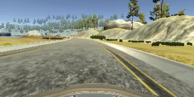

# **Self-Driving Car Engineer - Nanodegree** 
## ---Deep Learning---
# Behavioral Cloning Project

---
[//]: # (Image References)

[image1]: ./writeup/left.jpg "left image"
[image2]: ./writeup/center.jpg "center image"
[image3]: ./writeup/right.jpg "right image"
[image4]: ./writeup/woflip.jpg "without flip image"
[image5]: ./writeup/wflip.jpg "with flip image"
[image6]: ./writeup/cropped.jpg "cropped image"
[image7]: ./writeup/nvidia.jpg "NVDIA Architecture"
[image8]: ./writeup/loss.jpg "Output of loss metrics"


## Introduction
In this project a car should learn how to drive autonomously on a track in a simulator cloning human driving behaviour. A convolution neural network should be build and trained to predict the steering angle of the car. The data for training will be also created with the simulator build by the Udacity.

 

The goals / steps of this project are the following:
* Use the simulator to collect data of good driving behavior
* Build, a convolution neural network in Keras that predicts steering angles from images
* Train and validate the model with a training and validation set
* Test that the model successfully drives around track one without leaving the road
* Summarize the results with a written report


---
## Files and Code

My project includes the following files:
* model.py containing the script to create and train the model
* drive.py for driving the car in autonomous mode
* model.h5 containing a trained convolution neural network 
* this writeup.md summarizing the results

#### Run the Model
The model.py file the code for training and saving the convolution neural network as model.h5.

Using the Udacity provided simulator and my drive.py file, the car can be driven autonomously around the track by executing 
```sh
python drive.py model.h5
```

## Implementation

### Creating the Data
The data to train and validate the model will be created with the simulator of the Udacty. The data contains images which are taken with a frequency of 10h and the measurements such as steering angle, throttle, brake and speed. Here we are only using the steering angles because we predict only this measuremnet to drive the car autonomously. For every steering angle data point three images are generated. There is an image from the center, left and right camera.

|left|center|right|
|:--------:|:------------:|:------------:|
|![alt text][image1]| ![alt text][image2]| ![alt text][image3]|

The three images have all the same steering angle, which means that the model would learn to steer to the right or left when looking at an right or left image to recover to the center. To prevent this, I will add or substract an correction value of 0.25 to steering angle. 

To capture good driving behavior, I first recorded two laps on track one using center lane driving. 

I then recorded  one lap the vehicle recovering from the left side and right sides of the road back to center so that the vehicle would learn how to correct a driving fault. 
These video shows what a recovery looks like starting from the right side back to the center

 

Then I also recorded on lap from track two in order to get more data points.

I also recorded one lap driving the track in the other direction means clockwise. The first reason for that is to collect more right turns because the track is a loop and contains more left turns then right turns and the second reason is again to collect more data points.

To augment the data sat, I also flipped images and angles thinking that this would also equalize the amount of left and right turns and creates more data of course. For that randomly chose just one image of a data point to not make the data too big. For example, here is an image that has then been flipped:

|original image|flipped image|
|:--------:|:------------:|
|![alt text][image4]| ![alt text][image5]| 


I finally randomly shuffled the data set and put 20% of the data into a validation set. 

After the collection process, I had ## X ## number of data points. 


### Data Preprocessing

#### Normalization
The data first got nomrmalized using the keras lambda layer. Within the lambda layer each element of the data is getting normalized by dividing by the maximum value of an image pixel.

#### Mean Center
In a second step the images got mean centered by substracting 0.5 also within the lambda layer.

#### Cropping
Not all the imformation in the images are important to predict the steering angle. So with the keras cropping2D layer I cropped each image on top and bottom to take out the sky and the hood of the car. This might help the model to train faster.

For example, here is an image that has then been cropped:

|original image|cropped image|
|:--------:|:------------:|
|![alt text][image4]| ![alt text][image6]| 

### Model Architecture

This convolutional neural network (CNN) architecture is from NVIDIA's End to End Learning for Self-Driving Cars paper [the link](http://images.nvidia.com/content/tegra/automotive/images/2016/solutions/pdf/end-to-end-dl-using-px.pdf). The CNN is trained to map raw pixels from a single front-facing camera directly to steering commands. The system automatically learns internal representations of the necessary processing steps such as detecting useful road features with only the human steering angle as the training signal. This is pretty much the same usecase we have in this project.  

The CNN is shown in the image below.


![alt text][image7]


The network consists of 9 layers, including a normalization layer, 5 convolutional layers
and 3 fully connected layers. The normalization layer in my case got already inplemented in the data preprocessing step. 
The first three convolutional layers use a 2×2 stride and a 5×5 kernel. The last two convolutional layers are non-strided convolutions
with a 3×3 kernel size. The five convolutional layer are followed by three fully connected layers leading to an output control
value.


### Training

To train the model I did not need to implement a generator. I used the Adam optimizer within a 1e-4 learning rate. The amount of epochs were choosen by try an error and in the end XXXX epochs worked well.

To output the vaidation and train loss metrics the verbose parameter were added to the keras model.fit() method. The output of the loss metrics is shown in the following image:

![alt text][image8]

### My Approach
In this paragraph I am going to decribe step by step my approch which leads me to the above presented soultion.
1. Collecting the full data set with the simulator
2. Create the model.py with:
  * loading the data and fill two arrays with the image data and steering angle data, which will be the input data for the CNN later
  * correct the steering angle of left and right images
  * flipping one image per data point and add them to the data set
  * 
  


### Results


## Summary


####1. An appropriate model architecture has been employed

My model consists of a convolution neural network with 3x3 filter sizes and depths between 32 and 128 (model.py lines 18-24) 

The model includes RELU layers to introduce nonlinearity (code line 20), and the data is normalized in the model using a Keras lambda layer (code line 18). 

####2. Attempts to reduce overfitting in the model

The model contains dropout layers in order to reduce overfitting (model.py lines 21). 

The model was trained and validated on different data sets to ensure that the model was not overfitting (code line 10-16). The model was tested by running it through the simulator and ensuring that the vehicle could stay on the track.

####3. Model parameter tuning

The model used an adam optimizer, so the learning rate was not tuned manually (model.py line 25).

####4. Appropriate training data

Training data was chosen to keep the vehicle driving on the road. I used a combination of center lane driving, recovering from the left and right sides of the road ... 

For details about how I created the training data, see the next section. 

###Model Architecture and Training Strategy

####1. Solution Design Approach

The overall strategy for deriving a model architecture was to ...

My first step was to use a convolution neural network model similar to the ... I thought this model might be appropriate because ...

In order to gauge how well the model was working, I split my image and steering angle data into a training and validation set. I found that my first model had a low mean squared error on the training set but a high mean squared error on the validation set. This implied that the model was overfitting. 

To combat the overfitting, I modified the model so that ...

Then I ... 

The final step was to run the simulator to see how well the car was driving around track one. There were a few spots where the vehicle fell off the track... to improve the driving behavior in these cases, I ....

At the end of the process, the vehicle is able to drive autonomously around the track without leaving the road.

####2. Final Model Architecture

The final model architecture (model.py lines 18-24) consisted of a convolution neural network with the following layers and layer sizes ...

Here is a visualization of the architecture (note: visualizing the architecture is optional according to the project rubric)

![alt text][image1]

####3. Creation of the Training Set & Training Process

To capture good driving behavior, I first recorded two laps on track one using center lane driving. Here is an example image of center lane driving:

![alt text][image2]

I then recorded the vehicle recovering from the left side and right sides of the road back to center so that the vehicle would learn to .... These images show what a recovery looks like starting from ... :

![alt text][image3]
![alt text][image4]
![alt text][image5]

Then I repeated this process on track two in order to get more data points.

To augment the data sat, I also flipped images and angles thinking that this would ... For example, here is an image that has then been flipped:

![alt text][image6]
![alt text][image7]

Etc ....

After the collection process, I had X number of data points. I then preprocessed this data by ...


I finally randomly shuffled the data set and put Y% of the data into a validation set. 

I used this training data for training the model. The validation set helped determine if the model was over or under fitting. The ideal number of epochs was Z as evidenced by ... I used an adam optimizer so that manually training the learning rate wasn't necessary.
